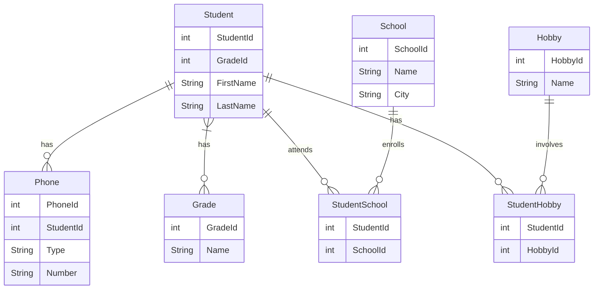

# db2022

## Beskrivning

I kursen DB2022 på IT-Högskolan skulle vi redovisa på färdigheter i SQL, Normalisering samt Java mot en relationsdatabas. Detta är min redovisning från denna kurs.
[Mermaid](https://mermaid-js.github.io/mermaid/#/entityRelationshipDiagram) är ett verktyg för att rita diagram i Markdown. Istället för exemplevis Lucidchart, valde vi Mermaid, för att få grafen kodnära.

## Entity Relationship Diagram



## Normalisera databas

```bash
cd wd
cd db2022
docker exec -i iths-mysql mysql -uiths -piths < normalisering.sql
docker exec -it iths-mysql bash
mysql -uiths -piths
```

## Köra java kod

```bash
gradle run
gradle check
```


